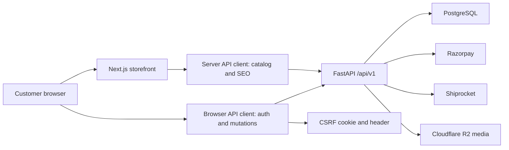

# AMZIRA Frontend Production Implementation Plan

Status: Frontend implementation complete; backend acceptance and release services remain

Frontend workspace: `/Users/parthkaswala/Desktop/amzira-frontend`

Backend contract reference: `/Users/parthkaswala/Desktop/amzira-backend`

Owned catalog migration reference: `docs/ETHZY_CATALOG_MIGRATION_PLAN.md`

## 1. Objective

Complete the customer-facing AMZIRA storefront to production-grade frontend quality before beginning a separate backend hardening and deployment phase.

The frontend will be implemented and tested against the existing local FastAPI backend. Backend files are a contract reference during this phase. Any required backend changes must be recorded in a handoff document instead of being mixed into frontend implementation work.

The initial public catalog remains focused on South Indian girls' lehenga choli and pattu pavadai. Women, men, and boys remain premium coming-soon experiences until inventory is intentionally enabled.

## 2. Implementation Result

Completed on 2026-08-11:

- The public storefront is now intentionally focused on South Indian girls' lehenga choli and pattu pavadai.
- Women, men, and boys discovery routes resolve to image-led premium coming-soon experiences and do not expose inventory.
- Typed browser clients, Zod response validation, CSRF, cookie sessions, timeout handling, and one authenticated refresh retry are implemented.
- Catalog URL filters, real variant identity, gallery zoom, delivery estimate, reviews, wishlist, guest/authenticated cart, profile, address CRUD, orders, tracking, invoice, cancellation, returns, and Razorpay verification UI are implemented.
- Simulated payment and unsupported COD controls were removed. Backend totals and verified order identity remain authoritative.
- Global loading, not-found, recoverable error, empty, guest, and unavailable states are present.
- CSP, HSTS, frame protection, referrer, permissions, private-route cache controls, and dependency overrides are implemented.
- Playwright covers Chromium, Firefox, and WebKit. The current suite passes 39/39 tests and includes Axe checks with zero serious or critical findings on key public routes.
- TypeScript, ESLint, the production build, production-header smoke tests, responsive screenshots, overflow checks, reduced motion, and the Impeccable visual detector pass.

### Readiness after implementation

| Measure | Readiness | Remaining work |
|---|---:|---|
| Frontend feature and UX implementation | **90%** | Monitoring, consented analytics, CI budgets, and fixture-backed authenticated acceptance |
| End-to-end production launch | **68%** | Backend taxonomy/inventory, test data, payment/webhook acceptance, cookie/CORS deployment configuration, and missing submission APIs |

The frontend is ready to move into backend work. It is not responsible to call the store launch-ready until the blockers in `docs/FRONTEND_BACKEND_CONTRACT_GAPS.md` are closed and the same browser suite runs with catalog fallback disabled against deterministic backend fixtures.

### Known frontend release debt

- Homepage first-load JavaScript is 178 kB, 8 kB above the 170 kB target; the motion-rich hero is the primary tradeoff.
- Sentry or an approved monitoring provider, consent management, and analytics event delivery still require production service decisions.
- Lighthouse/Core Web Vitals budgets and CI wiring remain release-engineering tasks.
- Newsletter, support, appointment, and store inquiry actions use honest email links until backend submission contracts exist.

## 2A. Original Baseline

### Already working

- Next.js 15 App Router storefront with responsive homepage, category, product, cart, checkout, account, legal, and support routes.
- Public catalog adapter with fallback product and category data.
- Girls' collection is the only publicly exposed category.
- Premium coming-soon routes for women, men, and boys.
- Product detail, variant selection, local cart, and simulated checkout UI.
- Login, signup, and forgot-password forms already call FastAPI auth routes.
- SEO metadata, canonical links, JSON-LD, robots, and sitemap foundations.
- TypeScript strict mode, ESLint, production builds, and Playwright E2E coverage.

### Current production blockers

- Product taxonomy identifiers are not aligned. Frontend uses `kids-pattu-pavadai`; backend launch checks use `kids`.
- API parsing is permissive and fallback-heavy, so backend contract regressions can be hidden.
- Guest cart uses `localStorage`; authenticated cart is not integrated.
- Checkout does not create addresses, validate stock, create a Razorpay payment order, or verify payment.
- Account page does not load user profile, addresses, wishlist, or orders.
- Order tracking, cancellation, invoice, returns, reviews, and wishlist UIs are incomplete.
- Newsletter, support, appointments, and store-locator forms do not have confirmed submission contracts.
- No frontend error monitoring, analytics event model, consent flow, automated accessibility audit, or Lighthouse budget.
- Browser coverage is Chromium-only.

### Production readiness estimate

The storefront is approximately **45% production-ready**. The visual foundation and route structure are significantly further along than the commerce implementation, so this number measures launch readiness rather than the amount of UI already designed.

| Area | Estimated readiness |
|---|---:|
| Brand, homepage, navigation, and responsive shell | 80% |
| Catalog, search, category, and product detail | 55% |
| Authentication and customer account | 35% |
| Cart, checkout, payment, orders, and returns | 20% |
| Accessibility, monitoring, performance, testing, and release controls | 35% |

Approximately **55% remains** before the frontend should be considered production-grade. Most of the remaining risk is in backend-connected customer journeys and launch hardening, not homepage presentation.

## 3. Scope

### In scope

- Storefront API architecture and typed contracts.
- Public catalog, PLP, search, PDP, inventory states, and delivery estimate.
- Authentication, session state, profile, addresses, and logout.
- Guest and authenticated cart behavior.
- Wishlist.
- Razorpay checkout and payment recovery UI.
- Order history, order details, tracking, invoice, cancellation, and return request UI.
- Reviews.
- Support, newsletter, appointment, and store inquiry frontend flows.
- SEO, accessibility, performance, security headers, analytics, monitoring, and release testing.
- Frontend documentation and backend handoff requirements.

### Out of scope for this frontend phase

- Backend schema migrations or FastAPI implementation changes.
- Admin dashboard UI.
- Adding women, men, or boys inventory.
- Native mobile applications.
- Marketplace, loyalty, referral, or multi-currency systems.
- Redesigning the established AMZIRA brand identity.

## 4. Target Architecture



### Frontend module layout

```text
lib/
  api/
    client.ts              shared request wrapper
    public-client.ts       server-safe public catalog calls
    browser-client.ts      credentialed browser calls with CSRF
    errors.ts              normalized API and validation errors
    schemas/               Zod request and response schemas
    catalog.ts
    auth.ts
    cart.ts
    checkout.ts
    account.ts
    orders.ts
    wishlist.ts
    reviews.ts
  commerce/
    taxonomy.ts            public route slug to API taxonomy mapping
    cart-store.ts          guest cart and authenticated synchronization
    pricing.ts             display-only formatting, never authority
  analytics/
    events.ts
    provider.tsx
components/
  ui/                      shared controls and state primitives
  catalog/
  account/
  cart/
  checkout/
  orders/
```

## 5. Architecture Decisions

### ADR-001: Separate public route slugs from backend category identifiers

Status: Accepted and implemented

Context:

- The current public route is `/category/kids-pattu-pavadai`.
- Backend launch health expects the category slug `kids`.
- Public SEO URLs should not change every time backend taxonomy changes.

Decision:

- Introduce a taxonomy configuration with `routeSlug`, `apiCategorySlug`, accepted legacy slugs, display name, and availability state.
- Preserve the current route initially.
- Query the backend with the configured API slug.
- Redirect legacy or alternate public routes to one canonical URL.

Consequences:

- Positive: SEO routes remain stable and inventory taxonomy can evolve.
- Negative: Mapping must be maintained deliberately.
- Backend handoff: confirm the final API category slug and seeded category ID.

### ADR-002: Use two API clients

Status: Accepted and implemented

Decision:

- Server API client for public catalog, category, product, SEO, and sitemap data.
- Browser API client for authentication and customer mutations using `credentials: include` and CSRF headers.
- Do not expose access or refresh tokens to React state or local storage.

Consequences:

- Public pages remain crawlable and cacheable.
- Authenticated account pages load customer data in client islands because API cookies belong to the API origin.
- A Next.js BFF is deferred unless production cookie-domain behavior proves unreliable.

### ADR-003: Backend owns stock, prices, tax, shipping, discounts, and order totals

Status: Accepted and implemented

Decision:

- Frontend totals are previews only.
- Cart and checkout display totals returned by FastAPI.
- Stock is revalidated before payment order creation.
- Frontend never submits a trusted price or discount amount.

### ADR-004: Hybrid guest cart with login synchronization

Status: Accepted and implemented

Decision:

- Guests keep a versioned local cart containing product ID, variant ID, and quantity only.
- On login, local items are synchronized to `/api/v1/cart/items` one at a time with conflict reporting.
- After successful synchronization, backend cart becomes authoritative and local guest data is cleared.
- Cart UI always refreshes from the backend after any authenticated mutation.

### ADR-005: Razorpay-only launch checkout

Status: Accepted and implemented

Decision:

- Implement the backend's checkout payment-intent flow.
- Remove Cash on Delivery from public UI until the backend has an explicit, tested COD checkout contract.
- Remove the simulated payment-failure control from production UI.

## 6. Non-Functional Targets

### Performance

- LCP below 2.5 seconds at the 75th percentile on mobile.
- INP below 200 milliseconds.
- CLS below 0.1.
- Public catalog API p95 target below 500 milliseconds from the frontend's perspective.
- Homepage initial JavaScript target below 170 kB, with noncritical motion and media lazy-loaded.
- Product and category images use fixed dimensions, responsive sizes, and verified CDN caching.

### Accessibility

- WCAG 2.1 AA for all customer journeys.
- Keyboard completion of search, product selection, cart, auth, checkout, and account flows.
- Visible focus states, announced form errors, logical heading order, and no focus traps.
- Reduced-motion handling for every automatic animation.
- Axe tests report zero serious or critical violations on key pages.

### Reliability

- Every API-backed screen has loading, empty, recoverable error, unauthorized, and unavailable states.
- Mutating buttons prevent double submission.
- Payment verification is idempotent from the customer's perspective.
- Cart is preserved through refresh, login, payment cancellation, and recoverable API failures.

### Security and privacy

- No auth token in local storage, session storage, URL, console, or analytics.
- CSRF header applied to state-changing browser requests.
- Environment configuration validated at startup.
- Frontend security headers include CSP, frame protection, referrer policy, and permissions policy.
- Analytics and marketing scripts load only after the appropriate consent decision.

### Browser support

- Latest stable Chrome, Safari, Firefox, and Edge.
- Mobile verification on iOS Safari and Android Chrome viewport profiles.

## 7. Implementation Phases

### Phase 0: Contract Freeze and Taxonomy Alignment

Estimated effort: 1-2 engineering days

Dependencies: backend can run locally; one seeded girls' product with active variants.

Tasks:

- Record the current frontend-to-backend endpoint matrix.
- Confirm the backend API prefix and local URL.
- Define the public route slug and backend category slug separately.
- Define canonical variant identity using backend `variant_id`, not the display size string.
- Confirm currency is INR and monetary fields are decimal rupees except Razorpay `amount`, which is paise.
- Confirm the production frontend and API origins and cookie behavior.
- Confirm whether registration should automatically log in or redirect to login.
- Confirm COD is disabled for initial launch.
- Confirm support, newsletter, appointment, and store inquiry endpoint ownership.
- Add a frontend `.env.example` with no secrets.
- Create `docs/FRONTEND_BACKEND_CONTRACT_GAPS.md` for unresolved backend requirements.

Acceptance criteria:

- One approved mapping exists for every frontend data field.
- No ambiguous category, variant, money, payment, or order identifier remains.
- The local backend health endpoint and one product endpoint can be reached from the frontend environment.

### Phase 1: API Foundation and Shared UI States

Estimated effort: 2-3 engineering days

Tasks:

- Replace the monolithic `lib/api.ts` with domain clients.
- Add a shared request wrapper with:
  - URL construction.
  - Request timeout via `AbortController`.
  - Standard response envelope parsing.
  - HTTP status normalization.
  - one refresh-and-retry attempt for authenticated `401` responses.
  - CSRF token acquisition for browser mutations.
  - safe error messages without leaking server internals.
- Add Zod schemas for categories, product lists, product details, user, address, cart, checkout, orders, wishlist, reviews, and tracking.
- Make schema mismatch visible in development and monitoring.
- Restrict fallback catalog data to development or explicit preview mode.
- Add reusable loading, empty, error, unauthorized, retry, and offline components.
- Add error boundaries for catalog, account, and checkout route groups.
- Add environment validation for:
  - `NEXT_PUBLIC_API_BASE_URL`.
  - `NEXT_PUBLIC_SITE_URL`.
  - `NEXT_PUBLIC_RAZORPAY_KEY_ID` only if the backend response does not remain authoritative.
  - analytics and monitoring IDs.

Acceptance criteria:

- A malformed API response produces a controlled error state.
- Production cannot silently fall back to demo products.
- Authenticated mutations consistently send credentials and CSRF.
- Unit tests cover success, validation error, unauthorized refresh, timeout, and network failure.

### Phase 2: Catalog, Search, Category, and PDP Completion

Estimated effort: 4-5 engineering days

Backend endpoints:

- `GET /api/v1/categories`
- `GET /api/v1/products`
- `GET /api/v1/products/{slug}`
- `GET /api/v1/products/{slug}/delivery-estimate`
- `GET /api/v1/reviews/product/{product_id}`

Tasks:

- Connect the live girls' category to the backend taxonomy mapping.
- Implement URL-driven search, sorting, price, fabric, size, color, occasion, stock, and pagination controls supported by the API.
- Remove decorative filters that do not modify results.
- Preserve filters in the URL for reload, sharing, browser back, and SEO consistency.
- Add skeleton, empty, error, and end-of-results states.
- Add product count and pagination metadata from the API.
- Complete PDP gallery with thumbnails, keyboard selection, mobile swipe, zoom dialog, and image fallback.
- Require an in-stock backend variant ID before Add to Cart is enabled.
- Display low-stock and sold-out states from current variant data.
- Add delivery estimate form with pincode validation and backend result rendering.
- Add size guide and measurement guidance appropriate for growing kids.
- Load reviews with pagination, rating summary, empty state, and sign-in prompt for submission.
- Validate metadata, canonical URL, Product JSON-LD, Offer availability, breadcrumbs, and social image per product.
- Ensure unavailable categories redirect before backend data is fetched.

Acceptance criteria:

- Catalog and PDP work with fallback data disabled.
- Every product card links to an API-backed product.
- Selecting a size selects a real `variant_id`.
- Search and filters are reproducible from the URL.
- Delivery estimate handles valid, invalid, unavailable, and timeout responses.
- Product pages remain usable with one image, no reviews, or no stock.

### Phase 3: Authentication and Account Session

Estimated effort: 3-4 engineering days

Backend endpoints:

- `GET /api/v1/auth/csrf-token`
- `POST /api/v1/auth/register`
- `POST /api/v1/auth/login`
- `POST /api/v1/auth/refresh`
- `POST /api/v1/auth/logout`
- `POST /api/v1/auth/forgot-password`
- `GET /api/v1/users/me`
- `PUT /api/v1/users/me`

Tasks:

- Move auth API logic into the browser client.
- Add a session provider with `loading`, `authenticated`, and `guest` states.
- Fetch `/users/me` after login and on account entry.
- Add one transparent access-token refresh attempt on `401`.
- Add logout to desktop and mobile account navigation.
- Redirect authenticated users away from login/signup.
- Preserve the intended destination through login, especially cart and checkout.
- Build account overview with profile summary and navigation to orders, addresses, wishlist, and returns.
- Add editable profile name and phone fields.
- Add field-level server validation messages and rate-limit handling.
- Ensure forgot-password response remains account-enumeration safe.
- Add password visibility control and accessible status announcements.

Acceptance criteria:

- Login, refresh, logout, signup, and forgot password work against local FastAPI.
- Reloading the page preserves the authenticated session through HttpOnly cookies.
- Expired sessions recover once or return the customer to login with cart intact.
- Account pages never render another customer's data.

### Phase 4: Addresses, Guest Cart, Authenticated Cart, and Wishlist

Estimated effort: 4-5 engineering days

Backend endpoints:

- `GET /api/v1/users/me/addresses`
- `POST /api/v1/users/me/addresses`
- `PUT /api/v1/users/me/addresses/{address_id}`
- `DELETE /api/v1/users/me/addresses/{address_id}`
- `GET /api/v1/cart/`
- `POST /api/v1/cart/items`
- `PUT /api/v1/cart/items/{item_id}`
- `DELETE /api/v1/cart/items/{item_id}`
- `DELETE /api/v1/cart/`
- `POST /api/v1/stock/check`
- Wishlist endpoints under `/api/v1/wishlist/`

Tasks:

- Version the guest cart schema and store only product ID, variant ID, quantity, and display fallback metadata.
- Add guest cart corruption recovery and migration.
- Build login cart synchronization with per-item conflict reporting.
- Replace client-calculated authenticated subtotal with backend cart summary.
- Add optimistic quantity controls with rollback on failure.
- Enforce quantity limits and available stock.
- Add cart loading, empty, partial-unavailable, price-changed, sold-out, and API-error states.
- Refresh cart after each mutation and before checkout.
- Build address list, create, edit, delete, and default-address interactions.
- Require confirmation before deleting a default or checkout-selected address.
- Add wishlist controls to product cards and PDP.
- Prompt guests to sign in when they use wishlist.
- Add wishlist page with empty and unavailable-product states.

Acceptance criteria:

- Guest cart survives reload.
- Guest cart synchronizes after login without silent item loss.
- Authenticated cart is consistent across devices after refresh.
- Cart never trusts stale price, stock, or totals.
- Wishlist state is consistent on product card, PDP, and account page.

### Phase 5: Checkout and Razorpay Payment

Estimated effort: 5-7 engineering days

Backend endpoints:

- `POST /api/v1/commerce/checkout`
- `POST /api/v1/commerce/create-payment-order`
- `POST /api/v1/commerce/verify-payment`

The exact router prefix must be confirmed from the generated OpenAPI document before implementation.

Tasks:

- Replace the simulated checkout with a state machine:
  - session check.
  - cart check.
  - address selection or creation.
  - checkout validation.
  - payment-order creation.
  - Razorpay modal.
  - server verification.
  - success or recoverable failure.
- Load Razorpay Checkout only on the checkout route.
- Use the backend-provided key, amount, currency, and Razorpay order ID.
- Prevent duplicate submit and duplicate payment modal launch.
- Display backend subtotal, tax, shipping, discount, and total.
- Remove COD until a backend COD contract is confirmed.
- Add coupon UI only after cart and checkout behavior is stable.
- Handle payment cancellation without clearing cart.
- Handle verification timeout by checking order/payment status before asking the customer to retry.
- Handle expired payment intent by creating a new payment order.
- Route success using the verified order number, never a client-generated value.
- Persist minimal non-sensitive checkout recovery context in session storage.
- Add purchase analytics only after backend verification succeeds.

Acceptance criteria:

- A successful Razorpay test payment creates exactly one order and clears the backend cart.
- Double clicking Place Order cannot create duplicate payment intents or orders.
- Invalid signatures, cancelled modals, insufficient stock, expired intents, and network failures show actionable recovery.
- Refreshing the success page does not repeat payment verification.
- No card or payment credential passes through AMZIRA frontend code.

### Phase 6: Order History, Tracking, Cancellation, Invoice, and Returns

Estimated effort: 4-5 engineering days

Backend endpoints:

- `GET /api/v1/orders/`
- `GET /api/v1/orders/{order_reference}`
- `PUT /api/v1/orders/{order_id}/cancel`
- `GET /api/v1/orders/{order_reference}/tracking`
- `GET /api/v1/orders/my/tracking`
- `GET /api/v1/orders/orders/{order_number}/invoice`
- `GET /api/v1/orders/{order_id}/return-eligibility`
- `POST /api/v1/returns/`

Tasks:

- Build account order history with status, date, total, item summary, and pagination.
- Build order detail with address, payment state, item pricing, timeline, and support actions.
- Build a semantic tracking timeline from backend status history.
- Add authenticated and public tracking entry flows according to backend authorization behavior.
- Add cancellation confirmation with eligible-state gating.
- Add invoice download with loading and failure recovery.
- Add return eligibility, return item selection, reason, notes, confirmation, and submitted status.
- Prevent unsupported status transitions in the UI.
- Add order-not-found, unauthorized, delayed shipment, delivered, cancelled, returned, and refund-pending states.

Acceptance criteria:

- Customers can see only their own order history and details.
- Status labels map every backend order and shipment state.
- Cancellation and return actions are shown only when the backend says they are eligible.
- Invoice download returns a valid PDF or a clear unavailable state.

### Phase 7: Reviews and Secondary Customer Flows

Estimated effort: 2-3 engineering days

Tasks:

- Add create, edit, and delete review UI with purchase/sign-in rules confirmed by backend.
- Replace footer newsletter GET navigation with a real submit interaction.
- Convert contact support, appointment, gift styling, and store inquiry pages into validated forms.
- Add explicit success, duplicate, rate-limit, and network-failure states.
- Add spam protection requirements to the backend handoff if no existing contract exists.
- Ensure coming-soon Join Updates captures department interest only after a confirmed subscription endpoint exists.

Acceptance criteria:

- No visible form is a dead or fake interaction.
- Every submission has a traceable success result and retry behavior.
- Personal data collection is covered by privacy copy and consent where required.

### Phase 8: Frontend Production Hardening

Estimated effort: 4-6 engineering days

#### Security

- Add Next.js security headers with a CSP compatible with Razorpay, API, R2, analytics, and fonts.
- Remove development API fallbacks in production.
- Add `no-store` rules for account, cart, checkout, and order data.
- Review all redirects and return URLs against open-redirect risks.
- Confirm no sensitive values enter logs, analytics, URLs, or browser storage.
- Add dependency audit and lockfile review.

#### Accessibility

- Add `@axe-core/playwright` checks to key routes.
- Test complete keyboard journeys.
- Test screen-reader names for navigation, gallery, variants, quantity, dialogs, forms, status, and payment recovery.
- Verify contrast and forced-colors behavior.
- Verify reduced motion.

#### Performance

- Run Lighthouse mobile and desktop for home, category, PDP, cart, and checkout.
- Add bundle analysis.
- Lazy-load Razorpay, analytics, noncritical video, and motion code.
- Replace GIF usage with optimized video or static reduced-motion alternatives.
- Audit image source dimensions and remove zero-byte or unused assets.
- Add performance budgets to CI.

#### Observability and analytics

- Add frontend Sentry or an approved equivalent.
- Record route errors, API failures, payment-stage failures, and Web Vitals without PII.
- Define analytics events:
  - `view_item_list`
  - `select_item`
  - `view_item`
  - `add_to_cart`
  - `view_cart`
  - `begin_checkout`
  - `add_shipping_info`
  - `add_payment_info`
  - `purchase`
  - `search`
  - `sign_up`
  - `login`
- Add consent management before nonessential scripts.

Acceptance criteria:

- Zero serious or critical Axe findings on critical journeys.
- Lighthouse accessibility at least 95 on audited routes.
- Core Web Vitals targets pass in controlled mobile tests.
- Frontend errors and failed payment stages appear in monitoring with release identifiers.
- Security header tests pass in production build mode.

### Phase 9: Test Expansion, CI, and Frontend Completion Gate

Estimated effort: 3-4 engineering days

Tasks:

- Add unit tests for API clients, schemas, cart migration, cart synchronization, money display, taxonomy mapping, and error normalization.
- Add component tests for forms and commerce state transitions where valuable.
- Expand Playwright projects to Chromium, Firefox, and WebKit.
- Add E2E scenarios:
  - public browse and search.
  - no-results and unavailable category.
  - signup, login, refresh, and logout.
  - guest cart and login merge.
  - quantity update, delete, price change, and stock failure.
  - address CRUD.
  - successful Razorpay test checkout.
  - payment cancel, verification failure, and recovery.
  - order history, tracking, invoice, cancellation, and return.
  - mobile navigation and checkout.
  - accessibility smoke checks.
- Add CI stages in this order:
  - install with lockfile.
  - lint.
  - typecheck.
  - unit tests.
  - production build.
  - browser tests against local test backend.
  - accessibility and performance budgets.
- Add preview environment smoke tests.

Acceptance criteria:

- CI passes from a clean checkout.
- No production test depends on fallback catalog data.
- Critical E2E tests run against deterministic backend fixtures.
- A failed checkout or auth contract blocks release.

## 8. Endpoint Integration Matrix

| Frontend capability | Backend endpoint | Frontend status | Required action |
|---|---|---:|---|
| Categories | `GET /categories` | Implemented | Seed and confirm live `kids` taxonomy |
| Product list/search | `GET /products` | Implemented | Backend fixture acceptance and pagination contract |
| Product detail | `GET /products/{slug}` | Implemented | Backend fixture acceptance |
| Delivery estimate | `GET /products/{slug}/delivery-estimate` | Implemented | Backend fixture acceptance |
| Signup/login/forgot | `/auth/*` | Implemented | Cookie/CORS deployment acceptance |
| Logout/refresh | `/auth/logout`, `/auth/refresh` | Implemented | Cookie/CORS deployment acceptance |
| Profile | `/users/me` | Implemented | Customer fixture acceptance |
| Addresses | `/users/me/addresses` | Implemented | Customer fixture acceptance |
| Cart | `/cart/*` | Implemented | Guest merge and stock fixture acceptance |
| Stock validation | Commerce checkout validation | Implemented | Confirm final endpoint namespace |
| Wishlist | `/wishlist/*` | Implemented | Customer fixture acceptance |
| Checkout preview | commerce `/checkout` | Implemented | Confirm root route namespace |
| Payment order | commerce `/create-payment-order` | Implemented | Razorpay test credentials and fixture acceptance |
| Payment verification | commerce `/verify-payment` | Implemented | Webhook/idempotency acceptance |
| Orders | `/orders/*` | Implemented | Order fixture acceptance |
| Tracking | `/orders/*/tracking` | Implemented | Shipment fixture acceptance |
| Invoice | `/orders/orders/{order_number}/invoice` | Implemented | PDF fixture acceptance |
| Returns | `/returns/*` and eligibility | Implemented | Return fixture acceptance |
| Reviews | `/reviews/*` | Implemented | Verified-purchase fixture acceptance |
| Coupons | `/coupons/validate` | Deferred | Not required for launch checkout |
| Newsletter/support | Not confirmed | Backend blocked | Add APIs; frontend currently uses email actions |

## 9. Failure-Mode Plan

| Failure | Customer impact | Frontend behavior |
|---|---|---|
| Backend unavailable | Catalog or account cannot load | Retry state, cached public content where valid, no fake inventory |
| Product removed | Stale URL | Product unavailable page with collection recovery CTA |
| Variant sold out | Add/checkout blocked | Preserve cart item, show current stock and replacement action |
| Price changed | Total changed | Highlight update and require checkout confirmation |
| Session expired | Mutation fails | One refresh attempt, then login with return URL and cart preserved |
| CSRF expired | Mutation rejected | Refresh CSRF once and retry safely |
| Razorpay cancelled | No order | Keep cart and address, allow retry |
| Payment captured but verify timed out | Uncertain order state | Poll/check order before offering another payment |
| Duplicate payment callback | Risk of duplicate order | Disable UI repeat; rely on backend idempotency and show existing order |
| Tracking provider unavailable | No live shipment update | Show last known backend status and support CTA |
| Image CDN unavailable | Broken visual | Reserved layout and branded fallback image |

## 10. Recommended Work Order

1. Phase 0 contract freeze.
2. Phase 1 API foundation.
3. Phase 2 catalog and PDP.
4. Phase 3 authentication.
5. Phase 4 addresses, cart, and wishlist.
6. Phase 5 checkout and Razorpay.
7. Phase 6 orders, tracking, invoices, and returns.
8. Phase 7 secondary customer forms.
9. Phase 8 hardening.
10. Phase 9 testing and completion gate.

Do not start Razorpay integration before variant IDs, authenticated cart, addresses, and checkout validation are complete.

## 11. Estimated Frontend Effort

For one experienced frontend engineer working sequentially:

| Workstream | Estimated days |
|---|---:|
| Contract and API foundation | 3-5 |
| Catalog, search, PLP, PDP | 4-5 |
| Authentication and account | 3-4 |
| Address, cart, wishlist | 4-5 |
| Checkout and payment | 5-7 |
| Orders, tracking, returns | 4-5 |
| Secondary flows | 2-3 |
| Hardening and testing | 7-10 |
| Total | 32-44 engineering days |

This is approximately 7-10 working weeks for one engineer after allowing for contract clarification, integration debugging, and review. Parallel work can reduce calendar time after Phase 1, but checkout should remain dependent on auth, address, and cart completion.

## 12. Definition of Frontend Complete

The frontend phase is complete only when all of the following are true:

- No customer-facing page contains placeholder, simulated, or “connect later” behavior.
- Fallback catalog data is disabled in production and E2E tests.
- The girls' catalog, product, cart, checkout, payment, account, and order journeys run against local FastAPI.
- All mutations use authenticated ownership, CSRF protection, and controlled retry behavior.
- Successful payment creates one verified order and routes to an API-backed success page.
- Payment cancellation and failure preserve the cart and provide safe recovery.
- Account includes profile, addresses, wishlist, orders, tracking, invoice, cancellation, and return entry points.
- All critical routes have loading, empty, error, unauthorized, and unavailable states.
- Typecheck, lint, unit tests, production build, multi-browser E2E, accessibility checks, and performance budgets pass in CI.
- Production environment variables, headers, analytics consent, and frontend monitoring are documented.
- Open backend requirements are recorded with endpoint, schema, status code, security, and acceptance-test expectations.

## 13. Backend Handoff Package

After the frontend completion gate, produce these artifacts before starting backend work:

- `docs/FRONTEND_BACKEND_CONTRACT_GAPS.md`
- Final endpoint matrix with implemented frontend consumers.
- Captured OpenAPI version or hash used during frontend development.
- Required taxonomy seed data for the live girls' collection.
- Required deterministic test users, products, variants, addresses, coupons, orders, and tracking fixtures.
- Payment test cases and expected Razorpay webhook states.
- Missing newsletter, support, appointment, and store inquiry contracts.
- Production CORS, cookie-domain, CSRF, CSP, R2, Razorpay, Shiprocket, SMTP, and monitoring configuration requirements.
- Load, security, backup, migration, and deployment tasks that remain backend-owned.

## 14. Backend Work Entry Gate

Frontend implementation is complete enough to begin the backend phase. Start backend work in this order:

1. Resolve the backend Redis/Celery dependency conflict and publish OpenAPI.
2. Seed the live `kids` category, products, variants, and inventory states.
3. Confirm checkout route namespacing and production cookie/CORS origins.
4. Add deterministic customer, cart, payment, order, return, review, and tracking fixtures.
5. Run the existing 39-test frontend suite with `NEXT_PUBLIC_ENABLE_CATALOG_FALLBACK=false`.
6. Add missing newsletter, support, appointment, and store inquiry APIs.
7. Configure monitoring, consented analytics, CI, and Lighthouse budgets before release approval.
